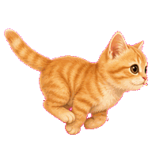
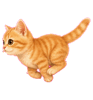
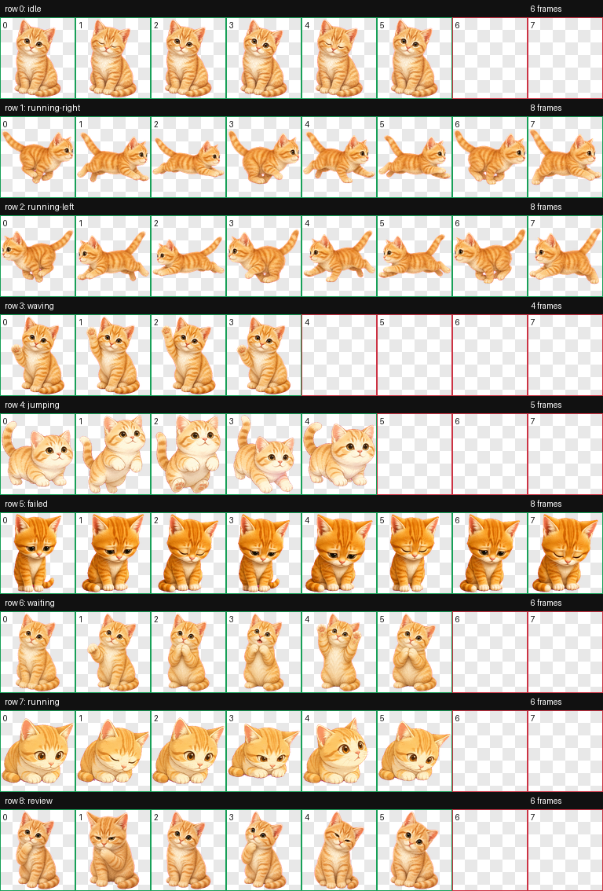

# 团团 Codex 桌面宠物

**当前版本：`v001-original`**  
**Pet metadata version: `v001`**

**团团是一只软萌、友好的橘白短毛小猫。**

它会眨眼、挥爪、等待、专注、跳起来，也会在任务失败时委屈地低下小脑袋。适合放在 Codex 旁边，安静陪你写代码、看 diff、等测试跑完。

## English Intro

Tuantuan `v001` is a soft, friendly orange-and-white shorthair kitten for Codex Pets. It comes with a validated `8x9` animated spritesheet, GIF previews for every supported state, and a ready-to-copy `pet.json` package. Drop it into `~/.codex/pets/tuantuan`, restart Codex, and let this tiny coding companion keep you company while you build, review, wait, and debug.


由 [JbBom](https://github.com/JbBom) 在 Codex 中生成，托管于 [codex-pet-share](https://codex-pet-share.pages.dev)。

## 本机核对

已和本机安装目录 `~/.codex/pets/tuantuan` 核对：

| 文件 | 结果 |
|---|---|
| `spritesheet.webp` | 与本机版本完全一致，SHA-256 为 `1b3b74e0688ad5db0b1e242eee4aa6facc746456f66cfe810877813b3ef65b62` |
| `pet.json` | 仓库版保留同一只团团，并额外补充了 `version`、`author`、`tags`、`source`、`sourceUrl`，更适合分享和归档 |

Spritesheet 校验通过：`1536x1872`、RGBA WebP、`8x9` atlas、透明像素残留为 `0`，没有 errors 或 warnings。

## 预览

| 待机 | 工作中 | 认真 review |
|---|---|---|
|  |  |  |

| 向右跑 | 向左跑 | 跳起来 |
|---|---|---|
|  |  |  |

| 等你一下 | 失败委屈 | 打招呼 |
|---|---|---|
|  |  |  |

完整精灵图总览：



## 安装

### 前提条件

- 已安装 Codex 桌面版
- Codex 版本支持 Pets 功能，也就是使用 `~/.codex/pets/` 目录

### 安装步骤

```bash
git clone https://github.com/JbBom/tuantuan-codex-pet.git
cd tuantuan-codex-pet

mkdir -p ~/.codex/pets
rm -rf ~/.codex/pets/tuantuan
cp -R v001-original ~/.codex/pets/tuantuan

ls ~/.codex/pets/tuantuan
# pet.json  spritesheet.webp
```

安装后重启 Codex，在 **Settings -> Pets** 中选择 **团团**。

### 一键安装

```bash
git clone https://github.com/JbBom/tuantuan-codex-pet.git /tmp/tuantuan-codex-pet
mkdir -p ~/.codex/pets
rm -rf ~/.codex/pets/tuantuan
cp -R /tmp/tuantuan-codex-pet/v001-original ~/.codex/pets/tuantuan
rm -rf /tmp/tuantuan-codex-pet
```

## 宠物文件

```text
v001-original/
  pet.json
  spritesheet.webp

assets/
  contact-sheet.png
  preview/*.gif
```

当前发布版本是 `v001-original`，对应 `pet.json` 中的 `version: "v001"`。

`spritesheet.webp` 使用 Codex pet atlas 布局：

| 行 | 状态 | 帧数 |
|---|---|---:|
| 0 | `idle` | 6 |
| 1 | `running-right` | 8 |
| 2 | `running-left` | 8 |
| 3 | `waving` | 4 |
| 4 | `jumping` | 5 |
| 5 | `failed` | 8 |
| 6 | `waiting` | 6 |
| 7 | `running` | 6 |
| 8 | `review` | 6 |

## 卸载

```bash
rm -rf ~/.codex/pets/tuantuan
```

重启 Codex 即可。

## 许可证

[MIT](LICENSE) © JbBom

用爱、Codex，以及一点点猫咪耐心生成。
