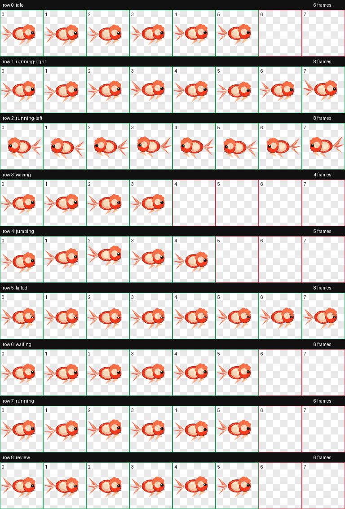

# 团团 Codex 桌面宠物

**当前版本：`v003-red-taishi-goldfish`**  
**Pet metadata version: `v003`**

**团团现在是一条红色泰狮金鱼。**

它有圆润的身体、红橙色鳞片、饱满头瘤和飘逸尾鳍。v003 没有把新图塞进不会播放的保留空位，而是严格按 Codex 当前支持的帧数来设计动作：每一张有内容的图都在会被播放的位置里。

## English Intro

Tuantuan `v003` is a cute red Thai lionhead goldfish for Codex Pets. It uses a validated `8x9` Codex pet atlas, with every visible frame placed inside the currently supported animation slots so the new artwork is not decorative filler. Drop it into `~/.codex/pets/tuantuan`, restart Codex, and let this little goldfish swim beside your coding sessions.


由 [JbBom](https://github.com/JbBom) 在 Codex 中生成，托管于 [codex-pet-share](https://codex-pet-share.pages.dev)。

## 版本说明

| 版本 | 说明 |
|---|---|
| `v001-original` | 原始橘白小猫版本，已发布为 GitHub Release `v001` |
| `v003-red-taishi-goldfish` | 当前红色泰狮金鱼版本，按 Codex 固定帧数重做，校验通过 |

Spritesheet 校验通过：`1536x1872`、RGBA WebP、`8x9` atlas、透明像素残留为 `0`，没有 errors 或 warnings。

## 预览

| 待机 | 工作中 | 认真 review |
|---|---|---|
|  |  |  |

| 向右游 | 向左游 | 跳起来 |
|---|---|---|
|  |  |  |

| 等你一下 | 失败委屈 | 打招呼 |
|---|---|---|
|  |  |  |

完整精灵图总览：



## 安装

### 前提条件

- 已安装 Codex 桌面版
- Codex 版本支持 Pets 功能，也就是使用 `~/.codex/pets/` 目录

### 安装步骤

```bash
git clone https://github.com/JbBom/tuantuan-codex-pet.git
cd tuantuan-codex-pet

mkdir -p ~/.codex/pets
rm -rf ~/.codex/pets/tuantuan
cp -R v003-red-taishi-goldfish ~/.codex/pets/tuantuan

ls ~/.codex/pets/tuantuan
# pet.json  spritesheet.webp
```

安装后重启 Codex，在 **Settings -> Pets** 中选择 **红泰狮团团**。

### 一键安装

```bash
git clone https://github.com/JbBom/tuantuan-codex-pet.git /tmp/tuantuan-codex-pet
mkdir -p ~/.codex/pets
rm -rf ~/.codex/pets/tuantuan
cp -R /tmp/tuantuan-codex-pet/v003-red-taishi-goldfish ~/.codex/pets/tuantuan
rm -rf /tmp/tuantuan-codex-pet
```

## 宠物文件

```text
v003-red-taishi-goldfish/
  pet.json
  spritesheet.webp

assets/
  v003/contact-sheet.png
  v003/preview/*.gif
```

当前发布版本是 `v003-red-taishi-goldfish`，对应 `pet.json` 中的 `version: "v003"`。

`spritesheet.webp` 使用 Codex pet atlas 布局：

| 行 | 状态 | 帧数 |
|---|---|---:|
| 0 | `idle` | 6 |
| 1 | `running-right` | 8 |
| 2 | `running-left` | 8 |
| 3 | `waving` | 4 |
| 4 | `jumping` | 5 |
| 5 | `failed` | 8 |
| 6 | `waiting` | 6 |
| 7 | `running` | 6 |
| 8 | `review` | 6 |

## 卸载

```bash
rm -rf ~/.codex/pets/tuantuan
```

重启 Codex 即可。

## 许可证

[MIT](LICENSE) © JbBom

用爱、Codex，以及一点点金鱼耐心生成。
